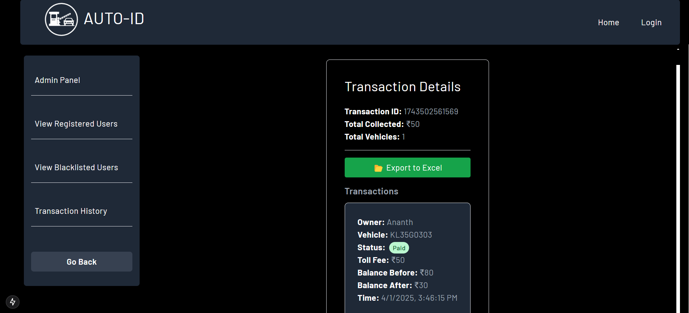

# 🚗 Auto-ID: Automated Toll Operation Identification and Deduction

Auto-ID is an advanced **AI-powered toll management system** that automatically identifies vehicle license plates from traffic videos, classifies vehicle types, and deducts toll fees from users’ wallets. The system integrates **real-time processing, Firebase, WebSockets, and Stripe payments** for a seamless experience.

---

## 🔥 Features
✅ **Automatic Vehicle Detection**: Identifies vehicles from uploaded videos using a Roboflow-trained model.  
✅ **License Plate Recognition**: Extracts number plates and checks registered users in Firestore.  
✅ **Wallet Recharge & Toll Deduction**: Users can recharge their wallets via **Stripe**, and toll fees are automatically deducted.  
✅ **Real-time Updates**: Detected vehicle numbers and transaction statuses update instantly via **WebSockets**.  
✅ **Admin Dashboard**: View and manage toll transactions, registered users, and blacklist status.  
✅ **Blacklist System**: Users failing toll payments **3 times** get blacklisted.  

---

## 🛠️ Tech Stack
- **Frontend**: Next.js (App Router), Tailwind CSS  
- **Backend**: Python (Flask)  
- **Database**: Firebase Firestore  
- **Payment Integration**: Stripe API  
- **Real-time Updates**: WebSockets, Firebase Firestore  

---

## 🚀 Getting Started

### **1️⃣ Clone the Repository**
```sh
git clone https://github.com/yourusername/auto-id.git
cd auto-id
```

### **2️⃣ Install Dependencies**
#### **Frontend**
```sh
cd frontend
npm install
npm run dev
```
#### **Backend**
```sh
cd backend
pip install -r requirements.txt
python app.py
```

### **3️⃣ Firebase Setup**
- Create a Firebase project  
- Enable **Firestore Database**  
- Add your Firebase config to the frontend & backend.  

### **4️⃣ Run the Application**
- **Frontend**: `npm run dev`  
- **Backend**: `python app.py`  
- Open `http://localhost:3000`  

---

## 📸 Screenshots

### **Home Page**


### **Login Page**


### **Sign Up Page**


### **User Profile**


### **Wallet Recharge**


### **Payment Processing (Stripe)**


### **Recharge History**


### **User Toll Transaction History**


### **Admin Dashboard**


### **Admin Control Panel**


### **Admin Toll Collection**


### **Registered Users**


### **Blacklist - No Blacklisted Users**


### **Blacklist - Blacklisted Users**


### **Toll Transaction History**


### **Detailed Transaction Record**


---

## 📜 About the Project
Auto-ID is designed to automate toll operations efficiently. By utilizing **computer vision and AI**, it reduces manual intervention in toll collection and enhances security. This project aims to:

- Minimize congestion at toll booths by automating vehicle detection and payments.
- Provide a secure and scalable system for toll operators using **cloud-based** solutions.
- Ensure transparency in transactions with a user-friendly interface for both admins and users.
- Reduce fraudulent activities by implementing a **blacklist** system for repeat offenders.
- Enable **real-time notifications** to keep users informed about their toll transactions.

With **Auto-ID**, toll operations become **seamless, secure, and efficient**, revolutionizing the way toll payments are handled.
